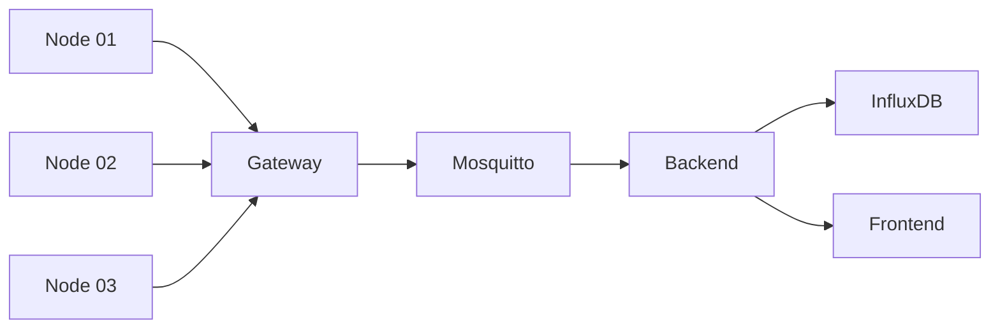
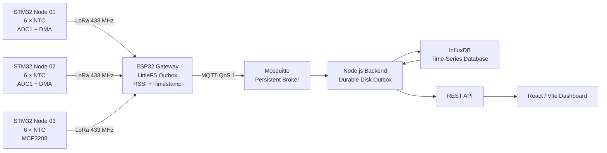
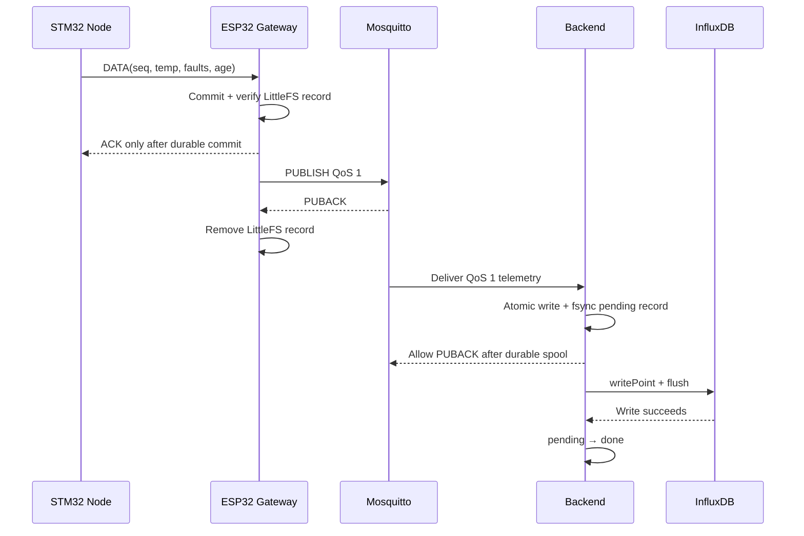

# IoT System

An end-to-end embedded IoT temperature-monitoring system built around three STM32 sensor nodes, an ESP32 LoRa gateway, a persistent MQTT transport layer, a durable Node.js ingestion backend, InfluxDB time-series storage, and a responsive React dashboard.

The project is designed as more than a basic sensor demo. Its main focus is **reliable data delivery across multiple failure boundaries**: LoRa retries, gateway-side flash persistence, MQTT QoS 1, broker persistence, backend disk spooling, timestamp reconstruction, detailed sensor diagnostics, and historical visualization.

---

## Demo Video

https://github.com/user-attachments/assets/30f4c5b5-e922-4a45-a616-c7000f7c39c6

---

## Table of Contents

- [Project Overview](#project-overview)
- [Main Features](#main-features)
- [Documentation Map](#documentation-map)
- [System Architecture](#system-architecture)
- [Hardware and Embedded Nodes](#hardware-overview)
- [End-to-End Runtime Flow](#end-to-end-runtime-flow)
- [Protocol and Sensor Pipeline](#lora-application-protocol)
- [Reliability Layers](#gateway-reliability-layer)
- [Data Model](#data-model)
- [Configuration, Build and Run](#configuration-and-secrets)
- [Verification and Failure Recovery](#verification-and-test-checklist)
- [Troubleshooting and Limitations](#troubleshooting)
- [References](#references)

***

## Project Overview

The system monitors six temperature channels on each of three remote sensor nodes.

```text
Node 01 ─┐
Node 02 ─┼─ LoRa 433 MHz ─ ESP32 Gateway ─ MQTT ─ Backend ─ InfluxDB
Node 03 ─┘                                                   │
                                                             └─ REST API ─ React Dashboard
```

The project is intentionally split into independent layers:

| Layer | Main technology | Responsibility |
|---|---|---|
| Sensor Node 01 | STM32F103 + internal ADC + SX1278 | Acquire six NTC channels and report diagnostics |
| Sensor Node 02 | STM32F103 + internal ADC + SX1278 | Acquire six NTC channels and report diagnostics |
| Sensor Node 03 | STM32F103 + MCP3208 + SX1278 | Acquire six external-ADC channels and report diagnostics |
| Gateway | ESP32 + SX1278 + LittleFS | Poll nodes, durably buffer telemetry, publish MQTT QoS 1 |
| Broker | Eclipse Mosquitto | MQTT routing, QoS session handling and persistence |
| Backend | Node.js + Express + MQTT.js | Durable MQTT ingestion, validation, REST API |
| Database | InfluxDB | Time-series persistence and historical queries |
| Frontend | React + Vite + Recharts | Monitoring, charting, filtering, fault visualization |

The overall design goal is:

```text
Acquire correctly
      ↓
Detect bad sensors
      ↓
Transport with retry
      ↓
Persist before acknowledgement
      ↓
Store historical data
      ↓
Present system state clearly
```

---

## Main Features

### Embedded nodes

- Three independently addressed STM32 nodes.
- Six temperature channels per node.
- NTC 10 kΩ, Beta 3950 temperature model.
- 16-sample acquisition burst.
- Trimmed-mean filtering.
- EMA temperature smoothing.
- Per-channel calibration scale and offset.
- Electrical fault detection.
- Temperature-range checking.
- Rate-of-change checking.
- Cross-sensor consistency checking.
- Persistent fault assertion and clearing.
- Detailed per-sensor diagnostic byte.
- Measurement midpoint timestamp.
- Compact fixed-point temperature payload.
- LoRa POLL → DATA → ACK transaction.
- DATA retransmission when ACK is missing.
- Application CRC-8 in addition to SX1278 payload CRC.

### Gateway

- Polls all three nodes sequentially.
- Validates application frames and CRC.
- Captures LoRa RSSI at packet reception.
- Detects duplicate DATA transactions.
- Persists telemetry to LittleFS **before ACKing the STM32 node**.
- Continues acquiring LoRa data while Wi-Fi/MQTT is unavailable.
- Uses native ESP-IDF MQTT client with QoS 1.
- Keeps records until MQTT PUBACK.
- Restores queued records after reboot.
- Migrates legacy NVS telemetry records.
- Generates globally unique record IDs.
- Reconstructs sample time from node sample age.
- Uses NTP when available without blocking LoRa acquisition.

### Server side

- Mosquitto authentication.
- Mosquitto disk persistence.
- Persistent backend MQTT session.
- Manual/delayed QoS acknowledgement after backend fsync.
- Durable backend outbox:
  - `pending/`
  - `done/`
  - `rejected/`
- Atomic file creation and directory sync.
- InfluxDB write + flush before marking ingestion complete.
- Poison-record rejection.
- Duplicate-record handling.
- REST APIs for:
  - health
  - latest state
  - history
  - ingestion status

### Frontend

- Responsive IoT dashboard.
- Light / dark / system themes.
- Adjustable font size.
- Configurable polling and freshness thresholds.
- 15 min / 1 h / 6 h / 24 h chart ranges.
- Interactive node visibility.
- Chart brush zoom and reset.
- Search by node/state/fault.
- Quick filters:
  - All
  - Online
  - Offline
  - Fault
- Current temperature.
- RSSI.
- Last sample age.
- Six-sensor health summary.
- Detailed sensor fault state.
- Alerts for offline/fault conditions.
- Compact system-health bar.
- Loading, empty and error states.
- Mobile hamburger navigation.
- Persistent browser settings via `localStorage`.

---

## Documentation Map

Each first-party subsystem has a dedicated README that documents the implementation boundary it owns.

| Subsystem | README | Implementation focus |
|---|---|---|
| Node 01 | [node01/README.md](node01/README.md) | STM32 ADC1 + DMA, six NTC channels, diagnostics, LoRa address `0x01` |
| Node 02 | [node02/README.md](node02/README.md) | Same internal-ADC pipeline as Node 01, LoRa address `0x02` |
| Node 03 | [node03/README.md](node03/README.md) | MCP3208 acquisition, `1.15` analog-gain compensation, LoRa address `0x03` |
| Gateway | [gateway/README.md](gateway/README.md) | LoRa polling, LittleFS durable FIFO, NTP reconstruction, MQTT QoS 1 |
| Broker | [broker/README.md](broker/README.md) | Mosquitto authentication, persistent sessions and persistence |
| Backend | [backend/README.md](backend/README.md) | Validation, fsync-backed ingest spool, InfluxDB and REST API |
| Frontend | [frontend/README.md](frontend/README.md) | React dashboard, freshness logic, faults, history and UI settings |



---

## System Architecture



### Reliability chain




The acknowledgement point is deliberately moved **after durable storage** at each important boundary.

```text
STM32 DATA
   │
   │  Gateway receives + validates
   ▼
Gateway LittleFS
   │
   ├── durable record verified
   │
   └── ACK sent to STM32
   ▼
MQTT QoS 1 publish
   │
   └── record kept until broker PUBACK
   ▼
Mosquitto persistent session
   ▼
Backend MQTT receive
   │
   ├── atomic file write
   ├── fsync(file)
   ├── rename
   ├── fsync(directory)
   └── MQTT ACK allowed
   ▼
Backend pending outbox
   │
   ├── InfluxDB write
   ├── writeApi.flush()
   └── pending → done
   ▼
Historical database
```

This design provides **at-least-once delivery semantics with deduplication**, not mathematical exactly-once delivery. The globally unique telemetry ID and transaction sequence fields are used to make retransmission safe.

---

## Repository Structure

```text
iot-system/
├── README.md
├── backend/
│   ├── README.md
│   ├── .env.example
│   ├── package.json
│   └── src/
│       └── index.js
├── broker/
│   ├── README.md
│   └── mosquitto-persistence.conf
├── frontend/
│   ├── README.md
│   ├── .env.example
│   ├── package.json
│   ├── public/
│   └── src/
│       ├── App.jsx
│       ├── App.css
│       ├── index.css
│       └── main.jsx
├── gateway/
│   ├── README.md
│   ├── platformio.ini
│   ├── partitions.csv
│   ├── include/
│   │   ├── secrets.example.h
│   │   └── secrets.h        # local only, do not commit
│   └── src/
│       └── main.cpp
├── node01/
│   ├── README.md
│   ├── MDK/
│   │   └── Node_1.uvprojx
│   └── USER/
│       ├── main.c
│       ├── adc_driver.c/.h
│       ├── spi_driver.c/.h
│       ├── sx1278.c/.h
│       └── systick_*.c/.h
├── node02/
│   ├── README.md
│   ├── MDK/
│   │   └── Node_2.uvprojx
│   └── USER/
│       └── ...
└── node03/
    ├── README.md
    ├── MDK/
    │   └── Node_3.uvprojx
    └── USER/
        ├── main.c
        ├── mcp3208.c/.h
        ├── spi_driver.c/.h
        ├── sx1278.c/.h
        └── systick_*.c/.h
```

Component documentation:

- [Backend](backend/README.md)
- [Broker](broker/README.md)
- [Frontend](frontend/README.md)
- [Gateway](gateway/README.md)
- [Node 01](node01/README.md)
- [Node 02](node02/README.md)
- [Node 03](node03/README.md)

---

## Hardware Overview

### Sensor nodes

| Component | Node 01 | Node 02 | Node 03 |
|---|---|---|---|
| MCU | STM32F103 | STM32F103 | STM32F103 |
| Number of sensors | 6 | 6 | 6 |
| ADC | STM32 ADC1 | STM32 ADC1 | MCP3208 |
| ADC resolution | 12-bit | 12-bit | 12-bit |
| Radio | SX1278 | SX1278 | SX1278 |
| LoRa frequency | 433 MHz | 433 MHz | 433 MHz |
| Temperature model | NTC Beta 3950 | NTC Beta 3950 | NTC Beta 3950 |
| Analog gain compensation | No | No | `1.15` |
| Node address | `0x01` | `0x02` | `0x03` |

### Node 01 / Node 02 internal ADC pins

| Sensor | ADC channel | STM32 pin |
|---:|---:|---|
| S1 | ADC channel 0 | PA0 |
| S2 | ADC channel 1 | PA1 |
| S3 | ADC channel 2 | PA2 |
| S4 | ADC channel 3 | PA3 |
| S5 | ADC channel 8 | PB0 |
| S6 | ADC channel 9 | PB1 |

ADC1 runs scan conversion with DMA circular mode.

### Node 03 MCP3208

Node 03 reads MCP3208 channels `CH0..CH5`.

```text
NTC divider
    ↓
Analog conditioning / gain
    ↓
MCP3208 CH0..CH5
    ↓ SPI1
STM32F103
```

MCP3208 chip select:

```text
PB0 → MCP3208 CS
```

### Shared STM32 SPI bus

| Signal | STM32 pin |
|---|---|
| SCK | PA5 |
| MISO | PA6 |
| MOSI | PA7 |

SX1278:

| Signal | STM32 pin |
|---|---|
| NSS / CS | PA4 |
| RESET | PB10 |

Node 03 shares SPI1 between the MCP3208 and SX1278 by using separate chip-select lines.

### ESP32 gateway LoRa pins

| Signal | ESP32 GPIO |
|---|---:|
| SCK | 18 |
| MISO | 19 |
| MOSI | 23 |
| NSS / SS | 27 |
| RESET | 14 |
| DIO0 | 26 |

---

## End-to-End Runtime Flow

### 1. Gateway polls a node

```text
Gateway
  |
  | POLL(addr=node, seq=N)
  v
STM32 Node
```

### 2. Node performs sensor acquisition

```text
POLL received
    ↓
Acquire 16 raw samples per channel
    ↓
Trim four low + four high values
    ↓
Average remaining eight values
    ↓
Electrical diagnostics
    ↓
NTC resistance
    ↓
Beta-3950 conversion
    ↓
Calibration
    ↓
Rate/cross-sensor diagnostics
    ↓
EMA
    ↓
Fault persistence
    ↓
Average healthy temperature
```

### 3. Node sends DATA

The node returns a 13-byte application payload and reuses the POLL sequence number.

### 4. Gateway makes the DATA durable

```text
Receive DATA
   ↓
validate
   ↓
capture RSSI
   ↓
persist LittleFS record
   ↓
verify persistent record
   ↓
ACK node
```

The node therefore does not consider the transaction complete until the gateway has a durable copy.

### 5. Gateway publishes MQTT QoS 1

When Wi-Fi and MQTT are available, the oldest persistent record is enqueued.

```text
LittleFS record
    ↓
MQTT PUBLISH QoS1
    ↓
broker PUBACK
    ↓
remove LittleFS record
```

### 6. Backend persists before acknowledging MQTT

```text
MQTT message
    ↓
validate JSON
    ↓
write temporary file
    ↓
fsync
    ↓
atomic rename to pending/
    ↓
fsync directory
    ↓
allow MQTT QoS1 acknowledgement
```

### 7. Influx worker drains pending records

```text
pending/
   ↓
InfluxDB write
   ↓
flush
   ↓
done/
```

### 8. Frontend reads live and historical state

```text
/latest         → current node state
/history        → chart points
/health         → backend health
/ingest-status  → durable ingestion health
```

---

## LoRa Application Protocol

### Frame format

```text
+-------+------+-------+-----+-----+----------+------+
| START | ADDR | TYPE  | SEQ | LEN | DATA...  | CRC8 |
+-------+------+-------+-----+-----+----------+------+
   1 B    1 B    1 B    1 B   1 B    LEN B      1 B
```

| Field | Size | Description |
|---|---:|---|
| `START` | 1 byte | Fixed `0xAA` |
| `ADDR` | 1 byte | Node address |
| `TYPE` | 1 byte | Application packet type |
| `SEQ` | 1 byte | Transaction sequence |
| `LEN` | 1 byte | Payload length |
| `DATA` | `LEN` | Payload bytes |
| `CRC8` | 1 byte | Application CRC-8 |

CRC input:

```text
ADDR | TYPE | SEQ | LEN | DATA
```

`START` is not included.

CRC parameters:

```text
Polynomial : 0x07
Initial    : 0x00
```

### Addresses

| Node | Address |
|---|---:|
| Node 01 | `0x01` |
| Node 02 | `0x02` |
| Node 03 | `0x03` |

### Packet types

| Type | Value |
|---|---:|
| DATA | `0x01` |
| ACK | `0x10` |
| POLL | `0x23` |

### DATA payload

```text
TEMP_L
TEMP_H
STATUS
FAULT_S1
FAULT_S2
FAULT_S3
FAULT_S4
FAULT_S5
FAULT_S6
AGE0
AGE1
AGE2
AGE3
```

Total:

```text
13 bytes
```

Temperature is a signed 16-bit little-endian value in centi-degrees Celsius:

```text
encoded = round(temperature_C × 100)
```

Example:

```text
32.14 °C → 3214
```

Reserved invalid value:

```text
-32768
```

`STATUS` uses six low bits:

```text
bit 0 → sensor 1 fault
bit 1 → sensor 2 fault
...
bit 5 → sensor 6 fault
```

`FAULT_S1..FAULT_S6` contain detailed fault bitmasks.

`AGE0..AGE3` contain `sampleAgeMs` as unsigned 32-bit little-endian data.

### Retry behavior

Current node transaction timing:

| Parameter | Value |
|---|---:|
| RX wait for POLL | 2000 ms |
| DATA TX timeout | 1000 ms |
| ACK wait timeout | 500 ms |
| Maximum DATA attempts | 3 |

A retry uses the **same sequence number**, allowing the gateway to detect duplicates safely.

---

## Sensor Acquisition and Diagnostics

### Trimmed mean

For each sensor:

```text
16 samples
   ↓ sort
discard lowest 4
discard highest 4
   ↓
average middle 8
```

This reduces the impact of transient ADC spikes without requiring a large signal-processing pipeline.

### Node 01 / Node 02 resistance calculation

For a divider that produces the ADC code used by the firmware:

```text
R_NTC = R_FIXED × raw / (4095 - raw)
```

with:

```text
R_FIXED = 10 kΩ
```

### Node 03 gain compensation

Node 03 compensates the external analog gain first:

```text
dividerRatio = (raw / 4095) / 1.15

R_NTC = R_FIXED × dividerRatio / (1 - dividerRatio)
```

### Beta 3950 conversion

All nodes use:

```text
R25  = 10 kΩ
Beta = 3950 K
T25  = 298.15 K
```

The temperature model is:

```text
1/T = 1/T25 + ln(R/R25)/Beta
```

then:

```text
T_C = T_K - 273.15
```

### Diagnostics

Node 01 / Node 02:

| Bit | Fault |
|---:|---|
| `0x01` | SHORT |
| `0x02` | OPEN |
| `0x04` | SIGNAL_NOISY |
| `0x08` | RESISTANCE |
| `0x10` | TEMP_RANGE |
| `0x20` | RATE |
| `0x40` | CROSS_SENSOR |
| `0x80` | MODEL |

Node 03:

| Bit | Fault |
|---:|---|
| `0x01` | SHORT |
| `0x02` | HIGH_SAT |
| `0x04` | SIGNAL_NOISY |
| `0x08` | RESISTANCE |
| `0x10` | TEMP_RANGE |
| `0x20` | RATE |
| `0x40` | CROSS_SENSOR |
| `0x80` | MODEL |

Important thresholds:

| Check | Node 01/02 | Node 03 |
|---|---:|---:|
| Short threshold | ≤ 20 counts | ≤ 20 counts |
| Open/high saturation | ≥ 4075 counts | ≥ 4075 counts |
| Maximum raw spread | 100 counts | 100 counts |
| Resistance minimum | 250 Ω | 250 Ω |
| Resistance maximum | 500 kΩ | 60 kΩ |
| Temperature minimum | -40 °C | -10 °C |
| Temperature maximum | 125 °C | 125 °C |
| Maximum rate | 10 °C/s | 10 °C/s |
| Cross-sensor delta | 12 °C | 12 °C |
| EMA alpha | 0.25 | 0.25 |

Fault persistence:

```text
3 consecutive bad observations → assert fault
5 consecutive good observations → clear fault
```

This prevents one noisy acquisition from rapidly toggling the UI between healthy and failed states.

---

## Gateway Reliability Layer

The gateway is documented in detail in [gateway/README.md](gateway/README.md).

Key behavior:

```text
LoRa starts first
Wi-Fi is background connectivity
MQTT is background connectivity
```

The gateway does not block node acquisition while waiting for the network.

### LittleFS outbox

The current design stores operational telemetry in a filesystem-backed queue.

Important parameters:

```text
Directory            : /outbox
Maximum records      : 2048
Reserved free space  : 128 KiB
```

The custom data partition is approximately 1.4 MiB.

### Persist-before-ACK rule

```text
DATA received
   ↓
persistent record built
   ↓
record CRC32 calculated
   ↓
file written
   ↓
file read/validated
   ↓
ACK sent
```

This is one of the most important reliability properties in the system.

### RSSI

RSSI is captured from the received LoRa packet:

```text
LoRa.packetRssi()
```

The value is stored with the persistent telemetry record and eventually appears as:

```json
"rssiDbm": -51
```

Old persisted records created before RSSI support are allowed to have no RSSI value.

### Time

The gateway combines:

- node measurement age,
- gateway receive time,
- nominal LoRa airtime compensation,
- NTP time when valid.

If NTP is temporarily unavailable, the telemetry can still be retained and later handled as recovered data.

---

## MQTT Broker Layer

The broker is Eclipse Mosquitto.

Current design requirements:

- TCP listener reachable by the ESP32 gateway.
- Authentication enabled.
- Anonymous access disabled.
- Persistence enabled.
- QoS 1 support.
- Persistent client session for the backend.

Example persistence settings:

```conf
persistence true
persistence_location /var/lib/mosquitto/
persistence_file mosquitto.db
autosave_interval 1
autosave_on_changes true
```

**Do not define Mosquitto persistence twice.**

Before adding a new configuration snippet:

```bash
sudo grep -RniE \
'^[[:space:]]*(persistence|persistence_location|persistence_file|autosave_interval|autosave_on_changes)' \
/etc/mosquitto/
```

See [broker/README.md](broker/README.md).

---

## Backend and InfluxDB Pipeline

The backend uses:

- Node.js
- Express
- MQTT.js
- `@influxdata/influxdb-client`
- CORS
- dotenv

MQTT subscription pattern:

```text
iot/+/telemetry
```

Expected topics:

```text
iot/node01/telemetry
iot/node02/telemetry
iot/node03/telemetry
```

### Durable disk ingestion

The backend deliberately does not treat a message as safe merely because JavaScript received it.

```text
MQTT
 ↓
validate
 ↓
durable local disk
 ↓
MQTT acknowledgement
 ↓
Influx worker
```

Runtime directories:

```text
backend/data/influx-outbox/
├── pending/
├── done/
└── rejected/
```

### REST APIs

| Endpoint | Purpose |
|---|---|
| `GET /health` | Backend service health |
| `GET /latest` | Current node snapshot |
| `GET /history` | Historical chart data |
| `GET /ingest-status` | Durable ingestion/outbox state |

History example:

```bash
curl -s \
'http://127.0.0.1:3000/history?minutes=60&window=5' | jq
```

The history response is designed for charting:

```json
{
  "rangeMinutes": 60,
  "windowSeconds": 5,
  "points": [
    {
      "time": "2026-08-11T20:42:45Z",
      "node01": 32.14,
      "node02": 31.80,
      "node03": 36.01
    }
  ]
}
```

A `null` node value represents an invalid/missing sample and is intentionally not interpolated by the frontend.

---

## Frontend Dashboard

The dashboard is documented in [frontend/README.md](frontend/README.md).

Main pages:

```text
Dashboard
Settings
Help
```

### Dashboard

Displays:

- total nodes,
- online nodes,
- offline nodes,
- average temperature,
- fault sensor count,
- time-series chart,
- node cards,
- RSSI,
- last sample age,
- detailed sensor status,
- alert banners,
- compact system health.

### Chart ranges

| Label | History | Suggested window |
|---|---:|---:|
| 15m | 15 minutes | 5 s |
| 1h | 60 minutes | 5 s |
| 6h | 360 minutes | 30 s |
| 24h | 1440 minutes | 120 s |

### Settings

Browser settings are persisted in:

```text
localStorage key: iot-system-ui-settings-v2
```

Available controls include:

- theme,
- font scale,
- auto refresh,
- telemetry polling interval,
- history refresh interval,
- offline threshold,
- default chart range,
- temperature decimal precision,
- chart grid.

---

## Data Model

### MQTT telemetry JSON

Typical current message:

```json
{
  "id": "gw-<efuse-mac>-<boot-nonce>-<sequence>",
  "seq": 25,
  "temp": 32.14,
  "tempValid": true,
  "status": 0,
  "faultDetailValid": true,
  "faults": [0, 0, 0, 0, 0, 0],
  "rssiDbm": -51,
  "sampledAtMs": 1786430000000,
  "ageMs": 104,
  "timestampValid": true,
  "recovered": false
}
```

### InfluxDB

Primary measurement:

```text
node_metrics
```

Typical fields:

```text
record_uid
seq
status
fault_detail_valid
temp_valid
recovered
timestamp_valid
age_ms
fault_s1
fault_s2
fault_s3
fault_s4
fault_s5
fault_s6
temp_avg
rssi_dbm
```

Node identity is stored as a tag.

Recovered records that cannot be assigned a trustworthy original sample timestamp may be separated from ordinary time-series samples instead of fabricating a timestamp.

---

## Configuration and Secrets

### Gateway

Create:

```text
gateway/include/secrets.h
```

from:

```text
gateway/include/secrets.example.h
```

Store:

- Wi-Fi SSID
- Wi-Fi password
- MQTT broker address
- MQTT username
- MQTT password

### Backend

Create:

```bash
cd backend
cp .env.example .env
```

Typical configuration:

```env
HOST=0.0.0.0
PORT=3000

MQTT_URL=mqtt://127.0.0.1:1883
MQTT_CLIENT_ID=backend-influx-01
MQTT_USER=<MQTT_USER>
MQTT_PASSWORD=<MQTT_PASSWORD>

INFLUX_URL=http://127.0.0.1:8086
INFLUX_TOKEN=<INFLUX_TOKEN>
INFLUX_ORG=<INFLUX_ORG_ID>
INFLUX_BUCKET=iot

CORS_ORIGIN=http://localhost:5173,http://<UBUNTU_LAN_IP>:5173
```

### Frontend

```env
VITE_API_BASE_URL=http://<UBUNTU_LAN_IP>:3000
VITE_NODE_OFFLINE_MS=12000
```

### Never commit secrets

Do not commit:

```text
gateway/include/secrets.h
backend/.env
frontend/.env
backend/data/influx-outbox/
```

Use example files with placeholders for documentation.

---

## Build and Flash

### Node 01

Open:

```text
node01/MDK/Node_1.uvprojx
```

Recommended build setting:

```text
Options for Target
→ C/C++
→ Optimization: O1
```

Build:

```text
F7
```

Download using ST-Link:

```text
F8
```

### Node 02

```text
node02/MDK/Node_2.uvprojx
```

Use the same O1 requirement.

### Node 03

```text
node03/MDK/Node_3.uvprojx
```

Use the same O1 requirement.

> Practical note: this project has been observed to fail LoRa timing at Keil optimization `O0`, while `O1` operates correctly. Treat `O1` as part of the known-good build configuration.

### Gateway

```bash
cd gateway

pio run
pio run -t upload
pio device monitor -b 115200
```

### Backend

```bash
cd backend

npm ci
node --check src/index.js
npm start
```

### Frontend

```bash
cd frontend

npm ci
npm run lint
npm run build
npm run dev -- --host 0.0.0.0
```

---

## Running the Complete System

Recommended startup order:

```text
1. InfluxDB
2. Mosquitto
3. Backend
4. Frontend
5. ESP32 Gateway
6. STM32 Nodes
```

### Services

```bash
sudo systemctl restart influxdb
sudo systemctl restart mosquitto

systemctl is-active influxdb
systemctl is-active mosquitto
```

Expected:

```text
active
active
```

### Backend terminal

```bash
cd ~/Documents/Project/iot-system/backend
npm start
```

### Frontend terminal

```bash
cd ~/Documents/Project/iot-system/frontend
npm run dev -- --host 0.0.0.0
```

### Gateway monitor

```bash
cd ~/Documents/Project/iot-system/gateway
pio device monitor -b 115200
```

### Ports

| Service | Port |
|---|---:|
| MQTT | 1883 |
| Backend | 3000 |
| Frontend | 5173 |
| InfluxDB | 8086 |

Check:

```bash
sudo ss -ltnp | grep -E '1883|3000|5173|8086'
```

---

## Verification and Test Checklist

### 1. InfluxDB

```bash
curl -s http://127.0.0.1:8086/health | jq
```

### 2. Mosquitto

```bash
systemctl is-active mosquitto
```

### 3. MQTT traffic

```bash
read -s -p "MQTT password: " MQTT_PASS
echo

mosquitto_sub \
  -h 127.0.0.1 \
  -p 1883 \
  -u <MQTT_USER> \
  -P "$MQTT_PASS" \
  -t 'iot/+/telemetry' \
  -v
```

Expected topics:

```text
iot/node01/telemetry
iot/node02/telemetry
iot/node03/telemetry
```

After testing:

```bash
unset MQTT_PASS
```

### 4. Backend health

```bash
curl -s http://127.0.0.1:3000/health | jq
```

### 5. Ingestion outbox

```bash
curl -s http://127.0.0.1:3000/ingest-status | jq
```

Healthy steady state normally trends toward:

```text
pending = 0
rejected = 0
workerRunning = true
lastInfluxError = null
```

### 6. Latest data

```bash
curl -s http://127.0.0.1:3000/latest | jq
```

Verify:

- node01 exists,
- node02 exists,
- node03 exists,
- temperature is plausible,
- `rssiDbm` is populated for new records,
- timestamps advance.

### 7. History

```bash
curl -s \
'http://127.0.0.1:3000/history?minutes=60&window=5' \
| jq '.points | length'
```

Expected:

```text
> 0
```

### 8. Browser

On the Ubuntu host:

```text
http://localhost:5173
```

From another LAN device:

```text
http://<UBUNTU_LAN_IP>:5173
```

---

## Failure Recovery

| Failure | Expected behavior |
|---|---|
| Node DATA TX fails | Node retries |
| Gateway ACK is lost | Node resends same sequence |
| Duplicate DATA arrives | Gateway deduplicates transaction |
| Wi-Fi fails | Gateway continues LoRa and queues LittleFS records |
| MQTT broker fails | Gateway retains LittleFS backlog |
| Gateway reboots | LittleFS backlog is restored |
| Backend temporarily stops | Persistent broker session can retain QoS traffic |
| InfluxDB fails | Backend `pending/` outbox accumulates |
| Backend reboots | Pending disk records survive and continue draining |
| NTP unavailable | Gateway keeps acquisition alive and preserves age information |
| Invalid sensor sample | Temperature becomes invalid/null rather than fabricated |

### LittleFS recovery

If the gateway reports a corrupted filesystem and the backlog is disposable, the data partition can be erased.

Current partition region:

```text
offset: 0x290000
size:   0x160000
```

Example:

```bash
esptool.py --chip esp32 erase_region 0x290000 0x160000
```

**Warning:** this destroys queued gateway telemetry. Use it only when filesystem recovery is necessary and no queued data must be retained.

---

## Troubleshooting

### No LoRa response

Check:

- all nodes use 433 MHz,
- node addresses are unique,
- SX1278 wiring,
- SPI wiring,
- power supply,
- Keil optimization is O1,
- antenna connection.

Gateway serial monitor:

```bash
pio device monitor -b 115200
```

### Gateway cannot connect to MQTT

Check:

```text
WIFI_SSID
WIFI_PASSWORD
MQTT_BROKER
MQTT_USER
MQTT_PASSWORD
```

Check Ubuntu LAN address:

```bash
hostname -I
```

Check listener:

```bash
sudo ss -ltnp | grep 1883
```

### Mosquitto fails to start

```bash
sudo systemctl status mosquitto --no-pager -l
sudo journalctl -u mosquitto -n 100 --no-pager
```

If the error mentions duplicated persistence configuration:

```bash
sudo grep -RniE \
'^[[:space:]]*(persistence|persistence_location|persistence_file)' \
/etc/mosquitto/
```

Keep only one authoritative persistence definition.

### Backend cannot write InfluxDB

Check:

```bash
curl -s http://127.0.0.1:3000/ingest-status | jq
```

Then inspect:

- `INFLUX_URL`,
- `INFLUX_TOKEN`,
- organization ID,
- bucket,
- token read/write permissions.

Do not configure an immediate zero retry timeout in the Influx client. The known-good backend allows real HTTP requests and handles retry through the durable worker.

### `/history` returns 500

Test Influx query access independently, then inspect backend logs.

Flux callbacks should use the record parameter expected by the installed Flux version:

```flux
|> filter(fn: (r) => r._measurement == "node_metrics")
```

not an unsupported named callback argument.

### Frontend is reachable locally but not from phone

Run Vite on all interfaces:

```bash
npm run dev -- --host 0.0.0.0
```

Check firewall:

```bash
sudo ufw allow 5173/tcp
sudo ufw allow 3000/tcp
```

Use the Ubuntu LAN address in:

```env
VITE_API_BASE_URL=http://<UBUNTU_LAN_IP>:3000
```

---

## Security Notes

This is a LAN-oriented engineering project. Before deploying on an untrusted network:

- do not expose Mosquitto port 1883 directly to the Internet,
- use unique MQTT credentials,
- consider separate credentials/ACLs for gateway and backend,
- use TLS for MQTT,
- place the web API behind HTTPS,
- restrict CORS to trusted origins,
- rotate InfluxDB tokens,
- keep all `.env` and `secrets.h` files out of Git,
- restrict firewall rules to the required LAN/subnet,
- protect physical debug/programming access on deployed devices.

No README example should contain production passwords, Wi-Fi keys or InfluxDB tokens.

---

## Known Limitations

- The sensor model is Beta-3950 rather than a full Steinhart-Hart calibration.
- Per-channel calibration coefficients currently default to scale `1.0` and offset `0.0`.
- The system uses MQTT QoS 1, so duplicates are possible and must remain safe.
- RSSI measures received radio signal strength, not end-to-end link quality by itself.
- The backend/frontend are currently LAN-oriented rather than production Internet services.
- The frontend Logout entry is not a complete authentication system.
- There is no remote firmware OTA pipeline for STM32 nodes.
- Gateway flash outbox capacity is finite.
- The current LoRa scheduler polls nodes sequentially rather than using a dynamic network scheduler.
- Sensor fault thresholds are engineering defaults and should be validated against final hardware.

---

## Future Improvements

Potential next steps:

1. Calibrate every sensor channel using measured reference points.
2. Store calibration coefficients in STM32 non-volatile memory.
3. Add LoRa SNR and packet-error statistics in addition to RSSI.
4. Add gateway queue-depth metrics to the backend.
5. Add backend Prometheus/OpenTelemetry metrics.
6. Add MQTT TLS and per-client ACLs.
7. Add user authentication and role-based dashboard access.
8. Add alert history and acknowledgement workflow.
9. Add CSV export for selected time ranges.
10. Add configurable temperature thresholds per node/sensor.
11. Add OTA update support for ESP32.
12. Add a controlled firmware update workflow for STM32.
13. Add automated integration tests for MQTT → InfluxDB → REST.
14. Add hardware-in-the-loop tests for POLL/DATA/ACK timing.
15. Add Docker/systemd deployment definitions for server services.
16. Add CI checks for frontend lint/build and backend syntax/tests.
17. Add database retention/downsampling policies for long deployments.
18. Add gateway watchdog and explicit health telemetry.
19. Add LoRa channel/link diagnostics over time.
20. Add a production reverse proxy with HTTPS.

---

This repository is intended to demonstrate the complete path from **embedded acquisition** to **reliable transport**, **durable ingestion**, **time-series storage**, and **operator-facing visualization**.

---

## References

- [STMicroelectronics — STM32F103 documentation](https://www.st.com/en/microcontrollers-microprocessors/stm32f103/documentation.html)
- [Semtech — SX1278 LoRa transceiver](https://www.semtech.com/products/wireless-rf/lora-connect/sx1278)
- [Microchip — MCP3208 12-bit ADC](https://www.microchip.com/en-us/product/mcp3208)
- [OASIS — MQTT Version 3.1.1](https://docs.oasis-open.org/mqtt/mqtt/v3.1.1/)
- [Eclipse Mosquitto — Configuration manual](https://mosquitto.org/man/mosquitto-conf-5.html)
- [Espressif — ESP-MQTT](https://docs.espressif.com/projects/esp-idf/en/stable/esp32/api-reference/protocols/mqtt.html)
- [InfluxData — JavaScript client](https://docs.influxdata.com/influxdb/v2/api-guide/client-libraries/nodejs/)
- [React documentation](https://react.dev/)
- [Vite documentation](https://vite.dev/guide/)
- [Recharts documentation](https://recharts.github.io/)
