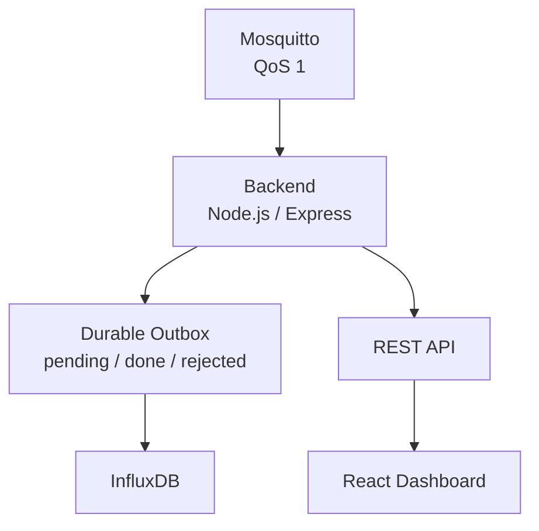
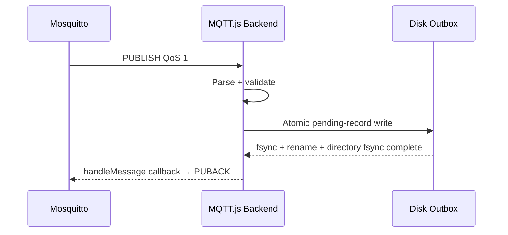
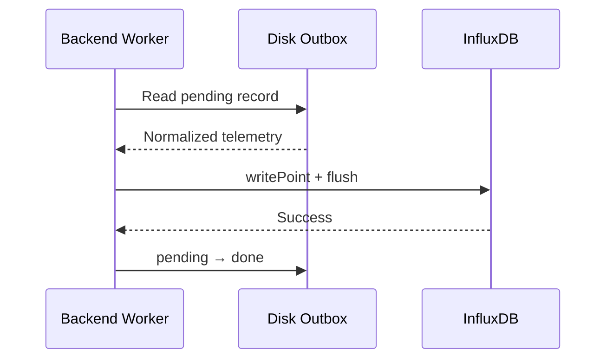

# IoT System — Backend

> Durable Node.js ingestion service that receives MQTT QoS 1 telemetry, validates it, commits it to a local disk outbox, writes time-series points to InfluxDB, and exposes REST APIs consumed by the IoT System dashboard.

[← Broker](../broker/README.md) · [↑ Root README](../README.md) · [Next: Frontend →](../frontend/README.md)

---

## Table of Contents

- [Overview](#overview)
- [Architecture and Responsibilities](#architecture)
- [Configuration](#environment-configuration)
- [MQTT Ingestion Contract](#mqtt-session-design)
- [Validation and Durable Outbox](#telemetry-validation)
- [InfluxDB Write Path and Data Model](#influxdb-write-path)
- [REST API](#rest-api)
- [Runtime, Testing and Failure Scenarios](#startup-and-shutdown)
- [Troubleshooting and Operations](#troubleshooting)
- [References](#references)

***

## Overview

The backend sits between the MQTT broker, InfluxDB and the frontend.



Unlike a simple MQTT callback that immediately writes to a database, this backend uses a **durable local ingestion stage**.

The critical rule is:

```text
MQTT message is not considered safely accepted
until its normalized telemetry record is durably written to local disk.
```

That allows the backend to continue acknowledging broker traffic even when InfluxDB is temporarily unavailable, without losing accepted telemetry.

---

## Responsibilities

The backend performs the following jobs:

1. Connect to Mosquitto using a persistent MQTT client ID.
2. Subscribe to `iot/+/telemetry` with QoS 1.
3. Parse the node identity from the topic.
4. Parse JSON payloads.
5. Validate every important telemetry field.
6. Reject malformed or contradictory payloads.
7. Persist valid records atomically to disk.
8. Detect duplicate record IDs.
9. Delay MQTT acknowledgement until disk durability is achieved.
10. Run a background worker that drains `pending/`.
11. Write valid data to InfluxDB.
12. Wait for `writeApi.flush()`.
13. Move completed records to `done/`.
14. Move poison records to `rejected/`.
15. Retain latest state independently from historical persistence.
16. Expose health and monitoring APIs.
17. Query InfluxDB history for the frontend.
18. Preserve RSSI and sample timestamp semantics.

---

## Architecture

```text
                    ┌───────────────────────────┐
                    │       Mosquitto           │
                    │      MQTT QoS 1           │
                    └─────────────┬─────────────┘
                                  │
                                  ▼
                    ┌───────────────────────────┐
                    │     MQTT validation       │
                    │ topic + JSON + fields     │
                    └─────────────┬─────────────┘
                                  │
                                  ▼
                    ┌───────────────────────────┐
                    │  Atomic disk persistence  │
                    │ temp → fsync → rename     │
                    └─────────────┬─────────────┘
                                  │
                         MQTT ACK can complete
                                  │
                                  ▼
┌──────────────┐       ┌───────────────────────────┐
│ REST /latest │◄──────│       pending/            │
└──────────────┘       └─────────────┬─────────────┘
                                    │ worker
                                    ▼
                         ┌─────────────────────────┐
                         │       InfluxDB          │
                         │ write + flush           │
                         └────────────┬────────────┘
                                      │
                                      ▼
                              ┌────────────┐
                              │   done/    │
                              └────────────┘
```

Poison data is isolated:

```text
invalid/unsupported disk record → rejected/
```

---

## Directory Structure

```text
backend/
├── README.md
├── .env.example
├── .env                 # local only
├── .gitignore
├── package.json
├── package-lock.json
├── src/
│   └── index.js
└── data/
    └── influx-outbox/
        ├── pending/
        ├── done/
        └── rejected/
```

The `data/influx-outbox` directory is runtime state and should not be committed.

---

## Dependencies

Current package dependencies:

| Package | Purpose |
|---|---|
| `express` | HTTP REST API |
| `mqtt` | MQTT client |
| `@influxdata/influxdb-client` | InfluxDB write/query client |
| `cors` | Browser-origin policy |
| `dotenv` | Environment configuration |

Project script:

```json
{
  "scripts": {
    "start": "node src/index.js"
  }
}
```

---

## Environment Configuration

Create a local configuration:

```bash
cd backend
cp .env.example .env
```

Recommended template:

```env
HOST=0.0.0.0
PORT=3000

MQTT_URL=mqtt://127.0.0.1:1883
MQTT_CLIENT_ID=backend-influx-01
MQTT_USER=<MQTT_USER>
MQTT_PASSWORD=<MQTT_PASSWORD>

CORS_ORIGIN=http://localhost:5173,http://<LAN_IP>:5173

INFLUX_URL=http://127.0.0.1:8086
INFLUX_TOKEN=<INFLUX_TOKEN>
INFLUX_ORG=<INFLUX_ORG_ID>
INFLUX_BUCKET=iot

INGEST_OUTBOX_DIR=./data/influx-outbox
INFLUX_RETRY_MS=5000
INGEST_DONE_RETENTION_HOURS=168
INGEST_DONE_MAX_ENTRIES=20000
```

### Configuration reference

| Variable | Default/required | Purpose |
|---|---|---|
| `HOST` | `0.0.0.0` | HTTP bind address |
| `PORT` | `3000` | HTTP port |
| `MQTT_URL` | `mqtt://127.0.0.1:1883` | Broker URL |
| `MQTT_USER` | optional in code, required by authenticated broker | MQTT username |
| `MQTT_PASSWORD` | optional in code, required by authenticated broker | MQTT password |
| `MQTT_CLIENT_ID` | `backend-influx-01` | Stable persistent session ID |
| `CORS_ORIGIN` | `*` | Allowed frontend origins |
| `INFLUX_URL` | required | InfluxDB server |
| `INFLUX_TOKEN` | required | InfluxDB API token |
| `INFLUX_ORG` | required | Organization ID used by query/write client |
| `INFLUX_BUCKET` | required | Bucket name |
| `INGEST_OUTBOX_DIR` | backend-local data directory | Durable spool location |
| `INFLUX_RETRY_MS` | `5000` | Worker retry delay |
| `INGEST_DONE_RETENTION_HOURS` | `168` | Done-receipt retention |
| `INGEST_DONE_MAX_ENTRIES` | `20000` | Maximum done receipts |

Never commit `.env`.

---

## MQTT Session Design

**Durable MQTT acceptance**



**InfluxDB drain**




The backend uses a stable client identity:

```text
backend-influx-01
```

and a persistent session:

```text
clean = false
```

The purpose is to allow Mosquitto to preserve relevant QoS/session state while the backend is temporarily disconnected.

Topic pattern:

```text
iot/+/telemetry
```

The backend accepts node topics matching the project convention:

```text
iot/node01/telemetry
iot/node02/telemetry
iot/node03/telemetry
```

### QoS 1 semantics

QoS 1 means:

```text
at least once
```

A message can be delivered more than once.

Therefore the project uses:

- a globally unique telemetry `id`,
- node `seq`,
- durable-record existence checks,
- done receipts,

to make duplicate delivery safe.

### Durable acknowledgement rule

The intended sequence is:

```text
PUBLISH received
    ↓
JSON validated
    ↓
durable record fsynced
    ↓
only now can MQTT acknowledgement complete
```

This means a backend process crash before disk persistence causes the broker to redeliver rather than silently losing the message.

---

## Telemetry Validation

A telemetry message is not trusted simply because it is valid JSON.

The backend validates:

- MQTT topic format,
- node identity,
- record `id`,
- sequence range,
- status bit range,
- `tempValid`,
- relationship between `temp` and `tempValid`,
- detailed fault array length,
- detailed-fault consistency,
- timestamp fields,
- `recovered`,
- RSSI type/range when present.

Typical message:

```json
{
  "id": "gw-001122334455-0123456789abcdef-0000000000000025",
  "seq": 25,
  "temp": 32.14,
  "tempValid": true,
  "status": 0,
  "faultDetailValid": true,
  "faults": [0, 0, 0, 0, 0, 0],
  "rssiDbm": -51,
  "sampledAtMs": 1786430000000,
  "ageMs": 104,
  "timestampValid": true,
  "recovered": false
}
```

### Status

Only the six sensor-summary bits are meaningful:

```text
0x00 ... 0x3F
```

### Fault details

`faults` must contain exactly six entries when detailed faults are valid.

### RSSI

Current RSSI validation accepts an integer in a broad radio-safe range:

```text
-200 ... +50 dBm
```

The broad range is for validation robustness; real SX1278 receive values are normally negative.

Pre-RSSI telemetry can omit/contain no RSSI and remains backward compatible.

---

## Durable Ingestion Outbox

Runtime tree:

```text
data/influx-outbox/
├── pending/
├── done/
└── rejected/
```

### Why a filesystem spool?

Without the spool:

```text
MQTT → InfluxDB
```

an InfluxDB outage can force the backend to either:

- stop acknowledging MQTT and depend entirely on broker queues, or
- acknowledge and risk data loss.

The spool inserts a local durable boundary:

```text
MQTT → disk → ACK
              ↓
           InfluxDB later
```

### Atomic write sequence

The implementation uses the standard durable-file pattern:

```text
1. create temporary file
2. write full JSON record
3. fsync temporary file
4. close
5. rename temporary file to final pending filename
6. fsync containing directory
```

This protects against partially written final records.

### Duplicate handling

The record ID is used as an idempotency key.

Before creating a new pending record, the backend can determine whether the same telemetry was already:

- pending,
- completed,
- or otherwise handled.

### Rejected records

Unreadable/unsupported/poison outbox records are moved away from `pending/` so one bad file cannot permanently block the worker.

Operationally:

```text
pending should drain
rejected should remain zero
```

unless intentionally testing malformed data.

---

## InfluxDB Write Path

Worker flow:

```text
while running:
    find pending records
        ↓
    load oldest/next record
        ↓
    construct Influx point
        ↓
    write point
        ↓
    await writeApi.flush()
        ↓
    pending → done
```

If InfluxDB is unavailable:

```text
pending remains on disk
worker records error
wait INFLUX_RETRY_MS
retry later
```

This is intentional.

### Important retry note

Do not configure the Influx client with an effective zero retry-time budget that prevents the HTTP request from being attempted.

The backend already has a durable application-level retry loop. Let the write request execute, then let the worker decide when to retry after a real failure.

---

## InfluxDB Data Model

Primary measurement:

```text
node_metrics
```

Recommended tag:

```text
node=node01|node02|node03
```

Fields include:

| Field | Meaning |
|---|---|
| `record_uid` | Global telemetry record ID |
| `seq` | LoRa transaction sequence |
| `status` | Six-bit node sensor-summary mask |
| `fault_detail_valid` | Detailed fault availability |
| `temp_valid` | Whether temperature is usable |
| `temp_avg` | Average healthy-node temperature |
| `fault_s1..fault_s6` | Per-sensor diagnostic bytes |
| `rssi_dbm` | Gateway-measured LoRa RSSI |
| `age_ms` | Age information |
| `timestamp_valid` | Sample timestamp trust |
| `recovered` | Telemetry restored from backlog |

The measurement timestamp should represent the actual sample time when it can be reconstructed reliably.

A recovered record without a trustworthy original sample timestamp should not be inserted into the normal time axis with a fabricated current time.

---

## REST API

Default base URL:

```text
http://127.0.0.1:3000
```

### `GET /health`

Purpose:

- confirm HTTP process is alive,
- expose service-level health used by frontend.

Test:

```bash
curl -s http://127.0.0.1:3000/health | jq
```

### `GET /latest`

Returns current state for each node.

Test:

```bash
curl -s http://127.0.0.1:3000/latest | jq
```

The current node model includes enough information for:

- temperature,
- `tempValid`,
- sensor status,
- detailed faults,
- last seen time,
- last temperature-update time,
- RSSI,
- data freshness.

### `GET /history`

Query parameters:

```text
minutes
window
```

Example:

```bash
curl -s \
'http://127.0.0.1:3000/history?minutes=60&window=5' \
| jq
```

Response shape:

```json
{
  "rangeMinutes": 60,
  "windowSeconds": 5,
  "points": [
    {
      "time": "2026-08-11T20:42:45Z",
      "node01": 32.14,
      "node02": 31.80,
      "node03": 36.01
    },
    {
      "time": "2026-08-11T20:42:50Z",
      "node01": 32.15,
      "node02": 31.80,
      "node03": null
    }
  ]
}
```

A null value is meaningful: the frontend should leave a visual gap rather than inventing an interpolated sensor reading.

### `GET /ingest-status`

Purpose:

- inspect worker activity,
- pending count,
- done receipts,
- rejected count,
- last successful Influx write,
- last Influx error.

Test:

```bash
curl -s http://127.0.0.1:3000/ingest-status | jq
```

---

## History Query

The project uses Flux over the `node_metrics` measurement.

Conceptually:

```flux
from(bucket: "<bucket>")
  |> range(start: -60m)
  |> filter(fn: (r) => r._measurement == "node_metrics")
  |> filter(fn: (r) =>
      r._field == "temp_avg" or
      r._field == "temp_valid"
  )
  |> aggregateWindow(
      every: 5s,
      fn: last,
      createEmpty: false
  )
```

The current implementation pivots temperature/validity information into rows that can be merged into:

```text
time | node01 | node02 | node03
```

### Flux callback syntax

Use:

```flux
fn: (r) => ...
```

for the installed Flux environment.

A callback written with an unsupported named argument can produce errors such as:

```text
found unexpected argument ...
missing required argument r
```

---

## RSSI Support

RSSI is measured at the gateway at LoRa reception time.

Pipeline:

```text
LoRa.packetRssi()
      ↓
gateway LittleFS record
      ↓
MQTT "rssiDbm"
      ↓
backend validation
      ↓
latest.rssiDbm
      ↓
Influx rssi_dbm
      ↓
frontend node card
```

This is the correct location to measure RSSI because the ESP32/SX1278 gateway is the radio receiver.

No STM32 payload byte is required for RSSI.

---

## Startup and Shutdown

### Install

```bash
cd backend
npm ci
```

### Syntax check

```bash
node --check src/index.js
```

### Run

```bash
npm start
```

Expected:

```text
Backend listening on http://0.0.0.0:3000
Connected to MQTT broker ...
Subscribed topic: iot/+/telemetry
```

Exact log text may evolve, but the process should show successful broker connection and active durable worker.

### Stop

```text
Ctrl+C
```

For production, run the backend under a service manager such as systemd rather than an interactive terminal.

---

## Testing

### Health

```bash
curl -fsS http://127.0.0.1:3000/health | jq
```

### Latest

```bash
curl -fsS http://127.0.0.1:3000/latest | jq
```

### Verify RSSI

```bash
curl -fsS http://127.0.0.1:3000/latest \
| jq '.. | .rssiDbm? // empty'
```

### History count

```bash
curl -fsS \
'http://127.0.0.1:3000/history?minutes=60&window=5' \
| jq '.points | length'
```

Expected:

```text
greater than zero while system data exists
```

### Outbox

```bash
curl -fsS http://127.0.0.1:3000/ingest-status | jq
```

### Inspect disk records

```bash
find data/influx-outbox -maxdepth 2 -type f | sort | head -50
```

### Influx health

```bash
curl -fsS http://127.0.0.1:8086/health | jq
```

---

## Failure Scenarios

### InfluxDB stopped

Expected:

```text
MQTT continues
backend persists records
pending count increases
lastInfluxError becomes non-null
```

After InfluxDB returns:

```text
worker retries
pending drains
done grows
lastInfluxError clears after successful writes
```

### Backend stopped

The Mosquitto persistent session is intended to preserve queued QoS state while the backend is unavailable, subject to broker/session configuration.

### Backend crashes after disk persistence

The pending record survives restart and is processed by the worker later.

### Duplicate MQTT delivery

The telemetry record ID prevents normal duplicate delivery from creating an uncontrolled duplicate-ingestion path.

### Invalid JSON

The message is rejected rather than transformed into guessed telemetry.

### Inconsistent temperature

Examples that should fail validation:

```text
tempValid=true with non-numeric temp
tempValid=false but an application path treats temp as valid
```

The backend must preserve invalidity semantics instead of substituting zero.

---

## Troubleshooting

### `401 Unauthorized` from InfluxDB

Check:

- `INFLUX_TOKEN`,
- bucket permissions,
- organization ID,
- read permission for history,
- write permission for ingestion.

### `bucket not found`

Check that the token, org ID and bucket belong to the same InfluxDB organization.

List buckets with the Influx CLI or UI before changing application code.

### `/history` fails but raw Influx query works

Run a direct JavaScript `getQueryApi(...).collectRows(...)` test using the same `.env`.

If that works, inspect the REST route transformation logic and print the complete exception object, including:

- `statusCode`,
- `body`,
- stack.

### Pending never drains

Check:

```bash
curl -s http://127.0.0.1:3000/ingest-status | jq
```

Then inspect InfluxDB connectivity and token permissions.

### CORS error in browser

Set:

```env
CORS_ORIGIN=http://localhost:5173,http://<LAN_IP>:5173
```

Restart backend after changing `.env`.

### Port 3000 not listening

```bash
sudo ss -ltnp | grep 3000
```

Check process output and `PORT`.

---

## Security

- `.env` must remain local.
- Never place Influx tokens in frontend code.
- Never expose backend secrets through REST endpoints.
- Restrict CORS in non-development deployments.
- Consider separate MQTT users for gateway publisher and backend subscriber.
- Prefer MQTT TLS on untrusted networks.
- Put the API behind HTTPS for remote access.
- Treat `done/`, `pending/` and `rejected/` telemetry as potentially sensitive operational data.
- Apply filesystem permissions so only the backend service account can modify the outbox.

---

## Performance and Retention

Current defaults:

```text
Influx worker retry          5 s
Done receipt retention       168 h
Done receipt max entries     20000
```

These are reliability-oriented defaults rather than high-throughput tuning values.

For longer deployments consider:

- periodic cleanup,
- InfluxDB retention policies,
- downsampling historical data,
- metrics for queue depth,
- service-level alerts when pending grows,
- moving runtime data to a dedicated filesystem if telemetry volume grows substantially.

---

## Future Improvements

1. Add automated backend unit tests.
2. Add schema tests for every telemetry version.
3. Add integration tests with a disposable Mosquitto + InfluxDB stack.
4. Add metrics for MQTT reconnect count.
5. Add metrics for pending queue age, not only count.
6. Add explicit dead-letter inspection tools.
7. Add rate limiting and HTTP request size limits.
8. Add authentication for REST APIs.
9. Add structured JSON logging.
10. Add systemd service files.
11. Add graceful shutdown that explicitly drains/flushes clients.
12. Add configurable node registry instead of fixed naming rules.
13. Add long-term RSSI/SNR history endpoints.
14. Add automated Influx bucket retention/downsampling setup.
15. Add Docker-based local integration environment.

---

## References

- [MQTT Version 3.1.1 — QoS 1](https://docs.oasis-open.org/mqtt/mqtt/v3.1.1/)
- [MQTT.js](https://github.com/mqttjs/MQTT.js)
- [Node.js File System API](https://nodejs.org/api/fs.html)
- [Express](https://expressjs.com/)
- [InfluxDB JavaScript client](https://docs.influxdata.com/influxdb/v2/api-guide/client-libraries/nodejs/)
- [InfluxDB Flux](https://docs.influxdata.com/flux/)

---

[← Broker](../broker/README.md) · [↑ Root README](../README.md) · [Next: Frontend →](../frontend/README.md)
