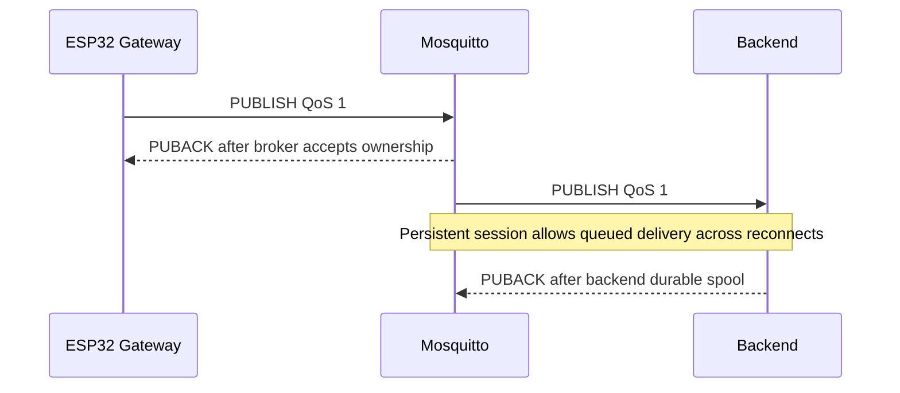

# IoT System — MQTT Broker

> Eclipse Mosquitto configuration and operational guide for the IoT System MQTT transport layer, with authentication, QoS 1 delivery and disk persistence.

[← Gateway](../gateway/README.md) · [↑ Root README](../README.md) · [Next: Backend →](../backend/README.md)

---

## Table of Contents

- [Overview](#overview)
- [Role in the Reliability Chain](#role-in-the-reliability-chain)
- [Installation and Listener Configuration](#installation)
- [Authentication and Password Management](#listener-and-authentication)
- [Persistence and QoS 1](#persistence)
- [Recommended Configuration](#recommended-configuration)
- [Operations and Verification](#service-management)
- [Failure Tests](#failure-tests)
- [Troubleshooting and Security](#troubleshooting)
- [References](#references)

***

## Overview

Mosquitto connects the ESP32 gateway to the Node.js backend.

```text
ESP32 Gateway
   │
   │ PUBLISH QoS 1
   ▼
Mosquitto :1883
   │
   │ persistent MQTT session
   ▼
Backend
```

The broker is not just a message router in this project. It is one of the system's durability layers.

When correctly configured, it provides:

- authenticated LAN connectivity,
- MQTT QoS 1 acknowledgement,
- persisted broker state,
- persistent backend session support,
- queued traffic during temporary subscriber outages.

---

## Role in the Reliability Chain




The full chain is:

```text
STM32
  ↓
Gateway LittleFS
  ↓
Mosquitto
  ↓
Backend disk
  ↓
InfluxDB
```

Gateway behavior:

```text
publish MQTT QoS1
    ↓
wait for PUBACK
    ↓
only then remove LittleFS record
```

Backend behavior:

```text
receive MQTT
    ↓
persist local disk
    ↓
allow acknowledgement
```

The broker is therefore the transport boundary between two durable stores.

---

## Directory Structure

Repository files:

```text
broker/
├── README.md
└── mosquitto-persistence.conf
```

Typical host files:

```text
/etc/mosquitto/mosquitto.conf
/etc/mosquitto/conf.d/*.conf
/etc/mosquitto/passwd
/var/lib/mosquitto/mosquitto.db
```

The repository snippet is a reference. The actual Ubuntu configuration may already define some of the same settings.

---

## Installation

Ubuntu/Debian:

```bash
sudo apt update
sudo apt install mosquitto mosquitto-clients
```

Enable service:

```bash
sudo systemctl enable mosquitto
sudo systemctl restart mosquitto
```

Check:

```bash
systemctl is-active mosquitto
```

Expected:

```text
active
```

Inspect detailed status:

```bash
sudo systemctl status mosquitto --no-pager -l
```

---

## Listener and Authentication

The ESP32 gateway must reach the broker over the LAN.

A typical authenticated listener configuration is:

```conf
listener 1883
allow_anonymous false
password_file /etc/mosquitto/passwd
```

Do not duplicate an existing `listener`, `allow_anonymous` or `password_file` definition without checking how your Mosquitto configuration is split.

Search current configuration:

```bash
sudo grep -RniE \
'^[[:space:]]*(listener|allow_anonymous|password_file)' \
/etc/mosquitto/
```

### Why anonymous access is disabled

The gateway publishes operational sensor data. Even on a development LAN, requiring credentials:

- prevents accidental unauthenticated publishing,
- reduces spoofed node telemetry,
- establishes a clean path toward ACL/TLS hardening.

---

## Persistence

Repository reference snippet:

```conf
persistence true
persistence_location /var/lib/mosquitto/
persistence_file mosquitto.db

autosave_interval 1
autosave_on_changes true
```

### Persistence file

Expected location:

```text
/var/lib/mosquitto/mosquitto.db
```

Check:

```bash
sudo ls -lh /var/lib/mosquitto/
```

### Force a persistence save

Mosquitto can be signalled to write persistence state:

```bash
sudo kill -USR1 "$(pidof mosquitto)"
```

Then:

```bash
sudo ls -lh --time-style=long-iso /var/lib/mosquitto/mosquitto.db
```

The modification time should update.

### Important configuration warning

Do **not** blindly install `broker/mosquitto-persistence.conf` if the host already contains:

```conf
persistence true
```

in `/etc/mosquitto/mosquitto.conf`.

Mosquitto can fail to start when the same persistence options are defined multiple times.

Always inspect first:

```bash
sudo grep -RniE \
'^[[:space:]]*(persistence|persistence_location|persistence_file|autosave_interval|autosave_on_changes)' \
/etc/mosquitto/
```

Then either:

- keep the existing global definition, or
- move the settings into one `conf.d` file,

but not both.

---

## Persistent Sessions and QoS 1

Backend client ID:

```text
backend-influx-01
```

The backend connects with:

```text
clean = false
```

This gives Mosquitto a stable session identity.

### QoS 1

QoS 1 means:

```text
PUBLISH
   ↓
at least one delivery
   ↓
PUBACK
```

Duplicates are allowed by the protocol, so application records use global IDs.

### Why persistence matters

Consider:

```text
Gateway publishes
Backend offline
Broker accepts session queue
Broker crashes/restarts
```

Without broker persistence, in-memory queued/session state may disappear.

With persistence, the broker has a better chance of restoring that state after restart.

This does not replace gateway LittleFS or backend disk persistence; each layer protects a different failure window.

---

## Recommended Configuration

A compact development-LAN setup may look like:

```conf
listener 1883

allow_anonymous false
password_file /etc/mosquitto/passwd

persistence true
persistence_location /var/lib/mosquitto/
persistence_file mosquitto.db

autosave_interval 1
autosave_on_changes true
```

Place each setting only once across the complete Mosquitto configuration.

Validate configuration before restart when possible:

```bash
mosquitto -c /etc/mosquitto/mosquitto.conf -v
```

Run this carefully: an existing system service may already own port 1883. For syntax-only workflow, use service logs after restart if needed.

---

## Password Management

Create a password file for the first time:

```bash
sudo mosquitto_passwd -c /etc/mosquitto/passwd <MQTT_USER>
```

Update an existing user:

```bash
sudo mosquitto_passwd /etc/mosquitto/passwd <MQTT_USER>
```

Then:

```bash
sudo systemctl restart mosquitto
```

Update credentials in all clients that use that account.

Gateway:

```text
gateway/include/secrets.h
```

Backend:

```text
backend/.env
```

Never put the real password in Git or README examples.

---

## Firewall

For LAN development:

```bash
sudo ufw allow 1883/tcp
```

A tighter deployment should restrict the source subnet/IP rather than exposing the broker to every network interface.

Inspect:

```bash
sudo ufw status
```

Check listener:

```bash
sudo ss -ltnp | grep 1883
```

---

## Service Management

Start:

```bash
sudo systemctl start mosquitto
```

Stop:

```bash
sudo systemctl stop mosquitto
```

Restart:

```bash
sudo systemctl restart mosquitto
```

Enable at boot:

```bash
sudo systemctl enable mosquitto
```

Logs:

```bash
sudo journalctl -u mosquitto -n 100 --no-pager
```

Follow logs:

```bash
sudo journalctl -u mosquitto -f
```

---

## Testing

### Read password without shell-history exposure

```bash
read -s -p "MQTT password: " MQTT_PASS
echo
```

### Subscribe to all node telemetry

```bash
mosquitto_sub \
  -h 127.0.0.1 \
  -p 1883 \
  -u <MQTT_USER> \
  -P "$MQTT_PASS" \
  -t 'iot/+/telemetry' \
  -q 1 \
  -v
```

Expected:

```text
iot/node01/telemetry {...}
iot/node02/telemetry {...}
iot/node03/telemetry {...}
```

### Publish a test message

Use a **test topic**, not a production telemetry topic, unless you intentionally want the backend to process it.

```bash
mosquitto_pub \
  -h 127.0.0.1 \
  -p 1883 \
  -u <MQTT_USER> \
  -P "$MQTT_PASS" \
  -t 'iot/test' \
  -q 1 \
  -m '{"message":"broker-test"}'
```

Clean the temporary shell variable:

```bash
unset MQTT_PASS
```

---

## Persistence Verification

### 1. Confirm config

```bash
sudo grep -RniE \
'^[[:space:]]*(persistence|persistence_location|persistence_file)' \
/etc/mosquitto/
```

### 2. Confirm database

```bash
sudo ls -lh /var/lib/mosquitto/mosquitto.db
```

### 3. Force save

```bash
sudo kill -USR1 "$(pidof mosquitto)"
```

### 4. Verify timestamp

```bash
sudo stat /var/lib/mosquitto/mosquitto.db
```

### 5. Restart

```bash
sudo systemctl restart mosquitto
systemctl is-active mosquitto
```

---

## Failure Tests

### Backend offline test

1. Keep Gateway running.
2. Stop backend.
3. Allow Gateway to publish QoS traffic.
4. Restart backend.
5. Observe whether queued/session traffic is delivered.
6. Confirm backend outbox and InfluxDB catch up.

### Broker offline test

1. Keep STM32 + Gateway powered.
2. Stop Mosquitto:

```bash
sudo systemctl stop mosquitto
```

3. Gateway should continue LoRa acquisition and retain LittleFS records.
4. Start Mosquitto:

```bash
sudo systemctl start mosquitto
```

5. Observe gateway backlog draining after reconnect.

### Broker reboot test

Restart:

```bash
sudo systemctl restart mosquitto
```

Verify:

- broker comes back active,
- backend reconnects,
- gateway reconnects,
- no unrecoverable queue error is reported.

---

## Troubleshooting

### Service fails after adding persistence snippet

Logs:

```bash
sudo journalctl -u mosquitto -n 100 --no-pager
```

If you see a duplicate persistence error, search:

```bash
sudo grep -RniE \
'^[[:space:]]*(persistence|persistence_location|persistence_file)' \
/etc/mosquitto/
```

Remove the duplicate definition.

### Gateway gets connection refused

Check:

```bash
sudo ss -ltnp | grep 1883
```

Ensure the broker listens beyond localhost if the ESP32 is a separate LAN device.

### Authentication error

Check:

- username in gateway/backend,
- password file path,
- password was updated in both clients,
- `allow_anonymous false` is intentional.

### Broker accepts local but not LAN connection

Check:

- listener binding,
- UFW,
- Ubuntu LAN IP,
- VLAN/client isolation,
- router/firewall rules.

### PUBACK observed but gateway backlog not deleting

This is likely a gateway-side MQTT message-ID/PUBACK matching issue rather than Mosquitto persistence. Inspect gateway serial logs.

---

## Security

Current authenticated TCP/1883 configuration is suitable for a trusted development LAN, not an untrusted Internet connection.

For stronger deployment:

- enable MQTT TLS on 8883,
- use a CA/server certificate,
- separate publisher/subscriber users,
- configure ACLs,
- deny wildcard publication from the gateway user,
- protect `/etc/mosquitto/passwd`,
- restrict port access by firewall,
- run Mosquitto under its service account,
- rotate passwords periodically.

Example future ACL concept:

```text
gateway user → write iot/node+/telemetry
backend user → read  iot/+/telemetry
```

---

## Future Improvements

1. TLS listener.
2. Per-client credentials.
3. Mosquitto ACL file.
4. Broker metrics monitoring.
5. Automated persistence smoke test.
6. systemd hardening.
7. Remote-log forwarding.
8. Message/session expiry policy review.
9. Capacity testing with extended gateway backlog.
10. Alert when broker persistence file cannot be written.

---

## References

- [Eclipse Mosquitto — mosquitto.conf manual](https://mosquitto.org/man/mosquitto-conf-5.html)
- [Eclipse Mosquitto — mosquitto_passwd](https://mosquitto.org/man/mosquitto_passwd-1.html)
- [MQTT Version 3.1.1](https://docs.oasis-open.org/mqtt/mqtt/v3.1.1/)

---

[← Gateway](../gateway/README.md) · [↑ Root README](../README.md) · [Next: Backend →](../backend/README.md)
