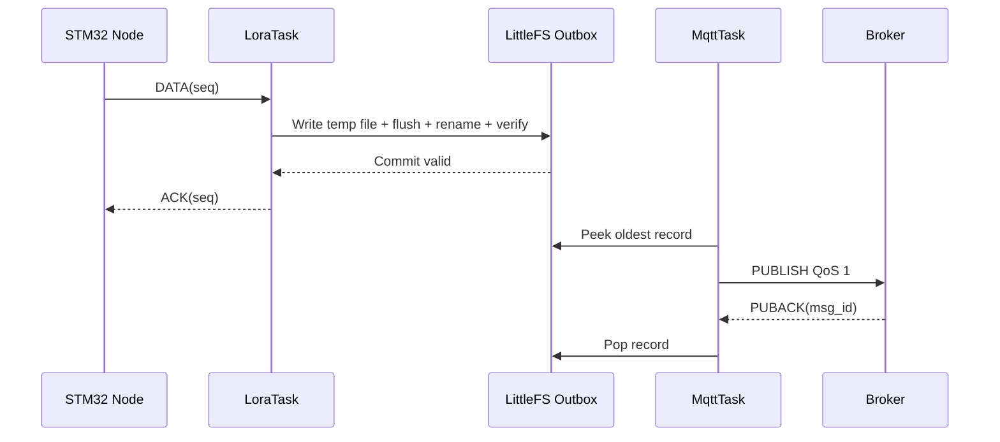

# IoT System — ESP32 LoRa Gateway

> ESP32 gateway that polls three STM32/SX1278 nodes, validates LoRa telemetry, captures RSSI, persists records to LittleFS before acknowledging nodes, and forwards the durable queue through MQTT QoS 1.

[← Node 03](../node03/README.md) · [↑ Root README](../README.md) · [Next: Broker →](../broker/README.md)

---

<p align="center">
  
</p>

---

## Table of Contents

- [Overview](#overview)
- [Hardware and Software Stack](#hardware)
- [LoRa Protocol and Polling](#lora-configuration)
- [Persist-Before-ACK Reliability](#persist-before-ack)
- [LittleFS Outbox and Record Format](#littlefs-outbox)
- [MQTT QoS 1 and Offline-First Operation](#mqtt-qos-1)
- [Timestamp Reconstruction and Record IDs](#timestamp-reconstruction)
- [Legacy Migration and Partitioning](#legacy-nvs-migration)
- [Configuration and Build](#configuration-and-secrets)
- [Reliability Tests and Recovery](#reliability-tests)
- [Troubleshooting and Limitations](#troubleshooting)
- [References](#references)

***

## Overview

The gateway bridges two very different networks:

```text
433 MHz LoRa                       Wi-Fi / MQTT
─────────────                      ─────────────
STM32 Nodes  ⇄  ESP32 Gateway  ⇄  Mosquitto
```

Its most important job is not protocol conversion. It is preserving telemetry while either side is temporarily unreliable.

Core rule:

```text
Never ACK a node DATA packet until the gateway has a durable copy.
```

Second core rule:

```text
Never delete a durable gateway record until MQTT PUBACK confirms QoS1 acceptance.
```

---

## Hardware

### ESP32

PlatformIO board target:

```text
nodemcu-32s
```

### SX1278 pins

| SX1278 | ESP32 |
|---|---:|
| SCK | GPIO18 |
| MISO | GPIO19 |
| MOSI | GPIO23 |
| NSS / SS | GPIO27 |
| RESET | GPIO14 |
| DIO0 | GPIO26 |

SPI setup:

```cpp
SPI.begin(18, 19, 23, 27);
```

### Radio

```text
Frequency          433 MHz
Spreading factor   SF7
Bandwidth          125 kHz
Coding rate        4/5
Preamble           8
Payload CRC        enabled
```

The STM32 nodes must use the same modem settings.

---

## Software Stack

- Arduino framework on ESP32.
- PlatformIO build system.
- Sandeep Mistry `LoRa` library for SX1278.
- native ESP-IDF `esp_mqtt_client`.
- LittleFS.
- Preferences/NVS for legacy migration metadata.
- FreeRTOS tasks.
- SNTP/NTP through ESP32 networking stack.

The native MQTT client replaced a simpler publish-only client so the application can track the MQTT message ID and wait for the `MQTT_EVENT_PUBLISHED` event corresponding to broker PUBACK.

---

## Project Structure

```text
gateway/
├── README.md
├── platformio.ini
├── partitions.csv
├── include/
│   ├── secrets.example.h
│   └── secrets.h          # local only
└── src/
    └── main.cpp
```

Key PlatformIO configuration:

```ini
[env:nodemcu-32s]
platform = espressif32
board = nodemcu-32s
framework = arduino
monitor_speed = 115200
board_build.partitions = partitions.csv

lib_deps =
    sandeepmistry/LoRa
```

---

## LoRa Configuration

Node list:

```text
0x01 → node01
0x02 → node02
0x03 → node03
```

Packet types:

```text
0x01 → DATA
0x10 → ACK
0x23 → POLL
```

Gateway polls nodes round-robin.

Representative timing:

```text
DATA wait timeout       1000 ms
Duplicate ACK window     700 ms
Node-cycle delay        1000 ms
RX poll delay              5 ms
```

These constants determine traffic cadence and duplicate handling.

---

## Application Protocol

Frame:

```text
START | ADDR | TYPE | SEQ | LEN | DATA | CRC8
```

with:

```text
START = 0xAA
CRC8 polynomial = 0x07
```

CRC input:

```text
ADDR | TYPE | SEQ | LEN | DATA
```

### Current DATA payload

Length:

```text
13 bytes
```

Layout:

```text
0   TEMP_L
1   TEMP_H
2   STATUS
3   FAULT_S1
4   FAULT_S2
5   FAULT_S3
6   FAULT_S4
7   FAULT_S5
8   FAULT_S6
9   AGE0
10  AGE1
11  AGE2
12  AGE3
```

`AGE0..3` is unsigned little-endian sample age in milliseconds.

The gateway retains compatibility with older telemetry payload versions where practical, but current nodes use the 13-byte timestamped detailed payload.

---

## Polling Scheduler

Conceptual loop:

```text
node01
  ↓
POLL seq=N
  ↓
wait DATA
  ↓
persist + ACK
  ↓
node02
  ↓
...
node03
  ↓
repeat
```

Each node has its own sequence progression.

The same sequence value links:

```text
POLL
DATA
ACK
```

into one transaction.

---

## Receiving and Deduplication

A DATA frame is accepted only after:

1. valid start byte,
2. valid length,
3. valid SX1278 packet CRC state,
4. valid application CRC-8,
5. expected node address,
6. expected packet type,
7. expected sequence or recognized duplicate transaction,
8. supported payload length.

### Why duplicates occur

Node behavior is:

```text
send DATA
wait ACK
if ACK missing:
    resend same DATA/SEQ
```

The gateway may already have persisted the first DATA but its ACK may have been lost over radio.

It must then:

```text
recognize duplicate
do not create uncontrolled duplicate durable record
send ACK again
```

This is required for safe at-least-once radio transport.

---

## RSSI

RSSI is captured immediately from the received LoRa packet.

Concept:

```cpp
int16_t rssiDbm = (int16_t)LoRa.packetRssi();
```

Pipeline:

```text
radio reception
   ↓
RSSI captured
   ↓
TelemetryMessage.rssiDbm
   ↓
LittleFS record
   ↓
MQTT JSON
```

MQTT:

```json
"rssiDbm": -51
```

### Why RSSI belongs in the gateway

RSSI is a property of the **received** signal at the receiving radio.

The node does not need to send its own RSSI value for the gateway receive link.

### Backward compatibility

Pre-RSSI persistent records are allowed to have no valid RSSI.

The MQTT layer can serialize these as `null` rather than pretending that `0 dBm` is a real receive measurement.

---

## Persist-Before-ACK




This is the gateway's primary reliability invariant.

Wrong design:

```text
DATA
 ↓
ACK immediately
 ↓
try to save later
```

A power loss between ACK and save loses data permanently because the STM32 already believes the transaction succeeded.

Current design:

```text
DATA
 ↓
normalize telemetry
 ↓
build persistent record
 ↓
write LittleFS
 ↓
verify record
 ↓
ACK
```

After ACK, the STM32 may safely forget the transaction because the gateway owns a durable copy.

---

## LittleFS Outbox

Operational outbox:

```text
/outbox
```

Limits:

```text
Maximum records      2048
Minimum free bytes   128 KiB
```

Records are ordered by persistent sequence.

On boot the gateway:

1. mounts LittleFS,
2. scans outbox files,
3. validates records/checksums,
4. rebuilds queue metadata,
5. resumes transmission.

This behavior has been used to recover hundreds of queued records after a gateway restart.

### Queue semantics

```text
new DATA
  ↓
append durable record

MQTT available
  ↓
take oldest record
  ↓
enqueue QoS1
  ↓
wait PUBACK
  ↓
delete oldest
```

This is a FIFO-style telemetry spool.

---

## Persistent Record Format

The filesystem record includes:

- magic,
- version,
- record sequence,
- node address,
- LoRa sequence,
- temperature,
- status,
- six fault bytes,
- sample-age information,
- gateway receive/time metadata,
- recovered state,
- RSSI,
- global ID material,
- checksum.

A CRC32 protects the persistent structure from silent file corruption.

Magic/version fields let firmware distinguish incompatible record layouts.

### Versioning

Current filesystem records use a versioned structure.

Older NVS/file records are not blindly interpreted as the newest struct. Migration/legacy structures exist explicitly.

This is essential because adding fields such as RSSI changes binary layout.

---

## MQTT QoS 1

The gateway uses:

```text
esp_mqtt_client
```

instead of relying on a high-level publish API that hides QoS acknowledgement state.

Publish path:

```text
LittleFS oldest record
    ↓
esp_mqtt_client_enqueue(... qos=1)
    ↓
msg_id returned
    ↓
wait MQTT_EVENT_PUBLISHED
    ↓
match msg_id
    ↓
remove record
```

Representative timing:

```text
enqueue retry delay      1000 ms
ACK check period          250 ms
ACK watchdog            60000 ms
retransmit timeout        3000 ms
```

### MQTT JSON

Typical message:

```json
{
  "id": "gw-<mac>-<bootNonce>-<sequence>",
  "seq": 25,
  "temp": 32.14,
  "tempValid": true,
  "status": 0,
  "faultDetailValid": true,
  "faults": [0, 0, 0, 0, 0, 0],
  "rssiDbm": -51,
  "sampledAtMs": 1786430000000,
  "ageMs": 104,
  "timestampValid": true,
  "recovered": false
}
```

Topic:

```text
iot/nodeXX/telemetry
```

---

## Wi-Fi and Offline-First Behavior

LoRa acquisition is not gated on Wi-Fi.

Boot concept:

```text
ESP32 starts
   ↓
LittleFS
   ↓
LoRa task active
   ↓
background Wi-Fi connect/reconnect
   ↓
background MQTT connect/reconnect
```

If Wi-Fi disappears:

```text
STM32 → LoRa → Gateway → LittleFS
```

continues.

When Wi-Fi returns:

```text
LittleFS backlog → MQTT → backend
```

drains.

Representative Wi-Fi reconnect interval:

```text
5000 ms
```

---

## Timestamp Reconstruction

The STM32 payload contains:

```text
sampleAgeMs
```

which is recomputed before every DATA retry from the midpoint of the actual acquisition burst.

The gateway also knows approximately how long the LoRa DATA packet spends on air.

Nominal current DATA airtime compensation:

```text
≈ 52 ms
```

When wall clock/NTP is valid:

```text
sampledAt ≈ gateway current time
            - node sample age
            - radio timing compensation
```

This is more accurate than assigning the MQTT publish time as the sensor measurement time, especially when records wait in the LittleFS backlog.

### NTP

Servers:

```text
pool.ntp.org
time.google.com
```

The gateway treats dates from 2024 onward as a threshold for plausible synchronized Unix time.

Network time synchronization is background functionality, not a prerequisite for accepting LoRa DATA.

---

## Global Telemetry ID

Record ID format:

```text
gw-<efuseMAC>-<bootNonce64>-<sequence>
```

Properties:

- stable gateway identity from eFuse MAC,
- random boot nonce separates reboot sessions,
- persistent/local sequence separates records inside the boot stream,
- string representation is safe across JavaScript number precision boundaries.

This ID is used by the backend for idempotency/deduplication.

---

## Legacy NVS Migration

Earlier firmware used an NVS telemetry queue.

Legacy namespace:

```text
tel_outbox
```

Legacy capacity:

```text
64 records
```

Current firmware can migrate legacy records into the LittleFS queue.

The purpose is upgrade safety:

```text
old firmware backlog
   ↓ firmware update
migration
   ↓
new filesystem outbox
```

Operational telemetry no longer relies on the small legacy NVS ring.

---

## Partition Table

Current custom table:

```csv
# Name,     Type, SubType, Offset,   Size,     Flags
nvs,        data, nvs,     0x9000,   0x5000,
otadata,    data, ota,     0xe000,   0x2000,
app0,       app, ota_0,    0x10000,  0x140000,
app1,       app, ota_1,    0x150000, 0x140000,
spiffs,     data, spiffs,  0x290000, 0x160000,
coredump,   data, coredump,0x3f0000, 0x10000,
```

The data region at `0x290000` is used by the application's LittleFS mount.

Approximate size:

```text
0x160000 = 1.375 MiB
```

The OTA partitions allow two application slots.

---

## Configuration and Secrets

Create:

```bash
cd gateway
cp include/secrets.example.h include/secrets.h
```

Conceptual content:

```cpp
#pragma once

#define WIFI_SSID       "<SSID>"
#define WIFI_PASSWORD   "<PASSWORD>"

#define MQTT_BROKER     "<UBUNTU_LAN_IP>"
#define MQTT_PORT       1883
#define MQTT_USER       "<MQTT_USER>"
#define MQTT_PASSWORD   "<MQTT_PASSWORD>"
```

Use the exact macro names expected by the current source/example file.

`secrets.h` must remain ignored by Git.

When Ubuntu LAN IP changes, update the gateway MQTT broker address and rebuild/flash.

---

## Build Flash and Monitor

Install PlatformIO first.

Check:

```bash
pio --version
```

Build:

```bash
cd gateway
pio run
```

Upload:

```bash
pio run -t upload
```

List devices:

```bash
pio device list
```

Explicit upload port when needed:

```bash
pio run -t upload --upload-port /dev/ttyUSB0
```

Serial monitor:

```bash
pio device monitor -b 115200
```

or:

```bash
pio device monitor \
  --port /dev/ttyUSB0 \
  --baud 115200
```

---

## Runtime Logs

Useful log categories:

- gateway identity,
- filesystem mount,
- outbox record count,
- legacy migration,
- LoRa initialization,
- Wi-Fi state,
- MQTT state,
- POLL node/sequence,
- DATA reception,
- RSSI,
- duplicate detection,
- persist success/failure,
- node ACK,
- MQTT enqueue message ID,
- MQTT PUBACK,
- record removal,
- NTP/time state.

### Large backlog at startup

When hundreds of records exist, boot can spend noticeable time scanning/validating the filesystem.

A pause after identity/filesystem logs does not automatically mean deadlock.

Observe serial output before resetting the gateway repeatedly.

---

## Reliability Tests

### Test 1 — MQTT outage

1. Start full system.
2. Stop Mosquitto.
3. Keep nodes/gateway powered.
4. Confirm LittleFS queue grows.
5. Restart Mosquitto.
6. Confirm queue drains after PUBACK.

### Test 2 — Wi-Fi outage

1. Disconnect AP/network.
2. Confirm LoRa poll/data continues.
3. Restore network.
4. Confirm MQTT reconnect.
5. Confirm backlog drains.

### Test 3 — Gateway reboot with backlog

1. Create queued records.
2. Reboot gateway.
3. Confirm startup reports restored records.
4. Restore broker/network.
5. Confirm old records publish.

### Test 4 — ACK loss

Introduce a condition where node misses ACK.

Expected:

```text
node retries same seq
gateway identifies duplicate
gateway ACKs duplicate
one logical telemetry record remains
```

### Test 5 — RSSI

Monitor MQTT:

```bash
mosquitto_sub ... -t 'iot/+/telemetry' -v
```

Verify new messages contain:

```json
"rssiDbm": -xx
```

---

## Filesystem Recovery

A corrupted filesystem can produce a mount error such as a corrupt directory pair.

If queued telemetry can be discarded, erase only the LittleFS data region:

```bash
esptool.py --chip esp32 erase_region 0x290000 0x160000
```

Then reboot/flash normally.

### Warning

This command erases the persistent gateway telemetry backlog.

Do not use it merely to “clean” a working device.

---

## Troubleshooting

### LoRa initialization fails

Check:

- 3.3 V power,
- antenna,
- SPI pins,
- NSS pin,
- RESET pin,
- SX1278 frequency variant,
- 433 MHz configuration.

### Nodes do not answer

Check node firmware optimization.

Known-good STM32 build:

```text
Optimization O1
```

O0 has produced LoRa timing failures in this project.

### MQTT never connects

Check:

- Wi-Fi,
- Ubuntu IP,
- port 1883,
- username/password,
- broker listener/firewall.

```bash
hostname -I
sudo ss -ltnp | grep 1883
```

### Queue grows although MQTT is connected

Inspect:

- `esp_mqtt_client_enqueue` return,
- message ID,
- `MQTT_EVENT_PUBLISHED`,
- PUBACK matching,
- watchdog/reconnect logs.

### LittleFS fills

The gateway intentionally refuses unbounded growth.

Investigate why MQTT/backend recovery is not occurring.

Do not solve a persistent network outage by simply raising `FILE_OUTBOX_MAX_RECORDS` without capacity planning.

---

## Known Limitations

- One gateway polls a fixed three-node list.
- 433 MHz channel/modem parameters are static.
- RSSI is stored, but SNR is not yet part of the telemetry model.
- Filesystem capacity is finite.
- No gateway web configuration portal.
- Wi-Fi credentials require firmware-side secret configuration.
- No production MQTT TLS yet.
- OTA partitioning exists, but a complete secure OTA management workflow is not documented.
- Polling cadence is fixed rather than adaptive.

---

## Future Improvements

1. Persist/report SNR.
2. Report queue depth and free filesystem space as gateway-health telemetry.
3. MQTT TLS.
4. Per-gateway certificate identity.
5. Configurable node registry.
6. Adaptive poll rate.
7. Radio link-quality statistics.
8. Watchdog/reset-reason telemetry.
9. OTA update management.
10. Filesystem wear/capacity metrics.
11. More formal persistent-record migration framework.
12. Unit tests for frame CRC and serialization.
13. Hardware-in-the-loop ACK/retry tests.
14. Dynamic channel/frequency configuration where legally appropriate.
15. Secure provisioning flow for Wi-Fi/MQTT secrets.

---

## References

- [Espressif — ESP-MQTT](https://docs.espressif.com/projects/esp-idf/en/stable/esp32/api-reference/protocols/mqtt.html)
- [Espressif — ESP32 Arduino Core](https://docs.espressif.com/projects/arduino-esp32/en/latest/)
- [Semtech — SX1278 LoRa transceiver](https://www.semtech.com/products/wireless-rf/lora-connect/sx1278)
- [OASIS — MQTT Version 3.1.1](https://docs.oasis-open.org/mqtt/mqtt/v3.1.1/)
- [PlatformIO — Project Configuration](https://docs.platformio.org/en/latest/projectconf/index.html)

---

[← Node 03](../node03/README.md) · [↑ Root README](../README.md) · [Next: Broker →](../broker/README.md)
